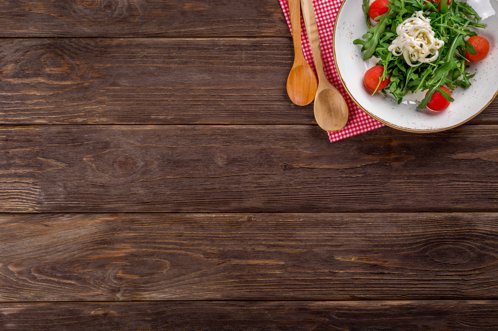
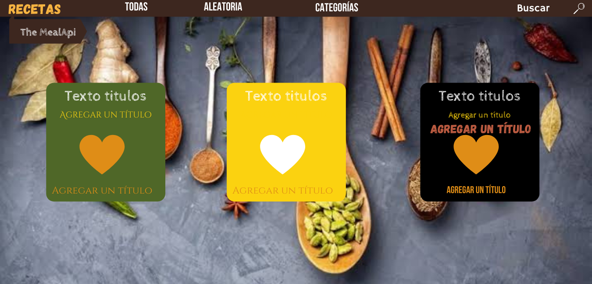
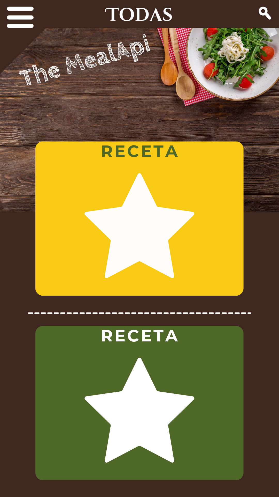
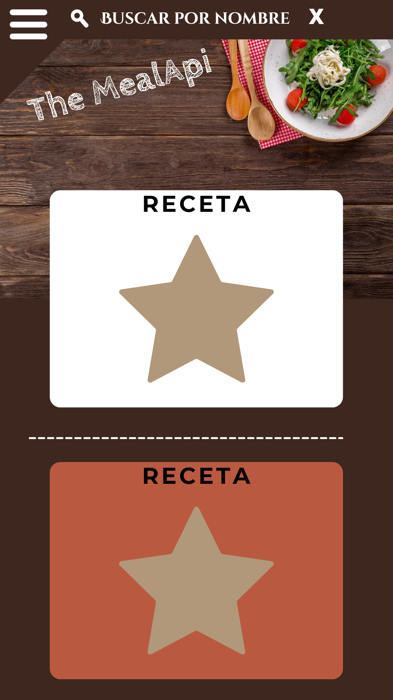
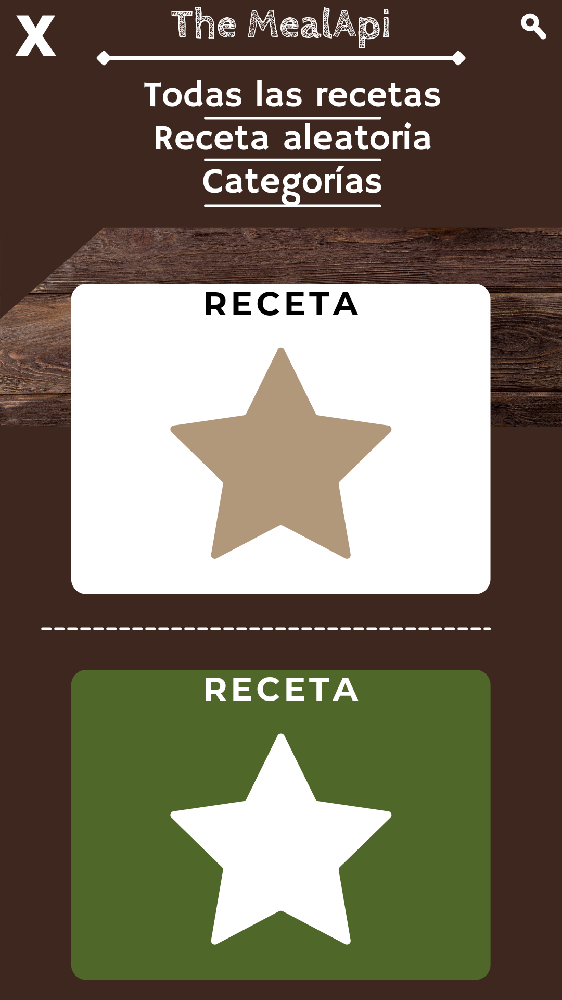

# Propuesta N° 1

## Paleta de colores
> `#3D271F` cafe fondo y navbar
`#F7CA15` amarillo
`#4F6728` verde
`#B95A40` naranja
`#DF8D17` naranja 2
`#FFFFFF` blanco
`#000000` negro
`#FBD210` amarillo 2
`#63921e` verde 2
`#4d3412`
`#f1e1bf`

## Fonts (@font-face)
> Titulo: `Cabin Sketch`
Titulo: `Gagalin`
Menu: `Bebas Neue`
Texto: `Cinzel Decorate`
Texto: `otro`

## assets

## web

Al cargar, genera una receta aleatoria, hay un boton en la tarjeta que genera una nueva receta aleatoria, y cuando se haga scroll esta el menu aleatoria que muestra una receta aleatoria en modal

En hover de una tarjeta:
 - mostrar los datos y ocultar la foto

En focus buscar:
 - ocultar aleatoria, todas y categorias, 
 - la lupa con animacion se va a la izquierda y aparece icono cerrar(x)

## móvil

Al cargar muestra todas las recetas

]Cuando se da click en buscar, con animacion se recorre de derecha a izquierda la lupa y aparece input, y al final icono x para borrar texto de input

Cuando se da click en menu hamburguesa, desplega las opciones; la animación del menú cambia a icono x

Boton abajo genera nueva receta aleatoria