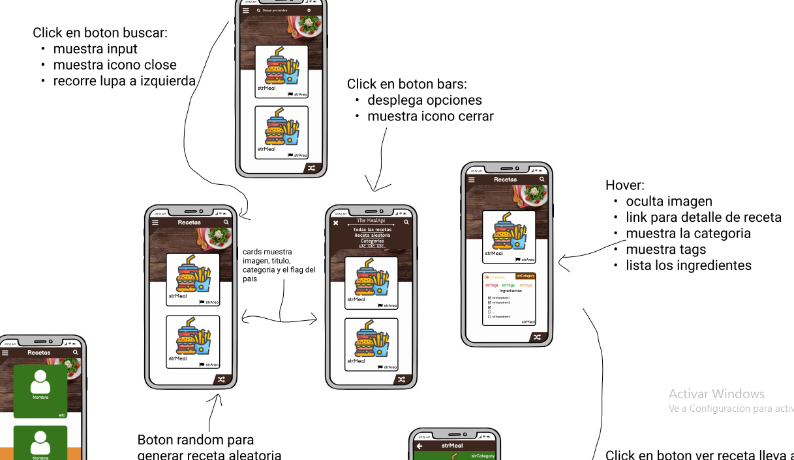
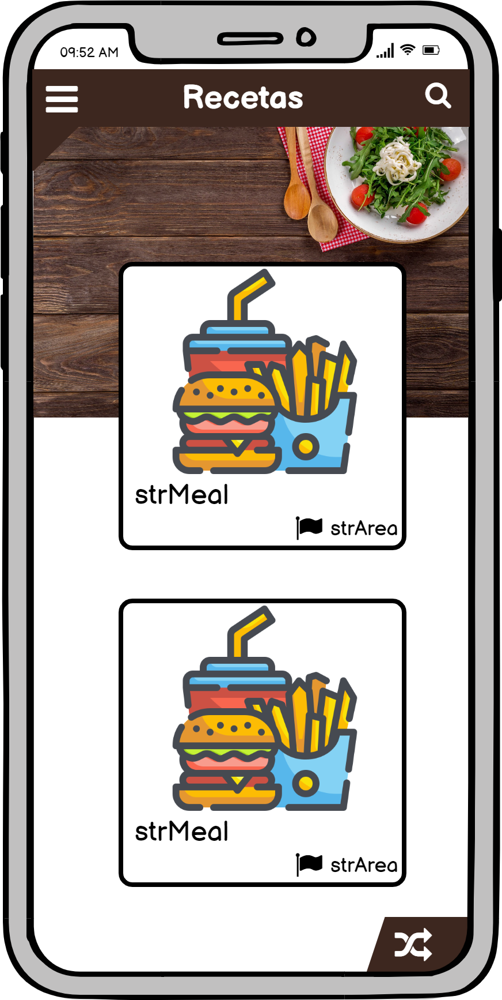
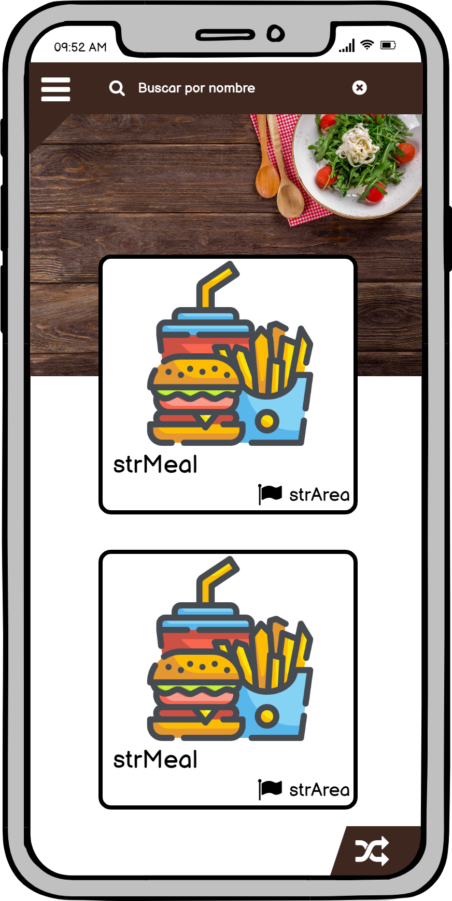
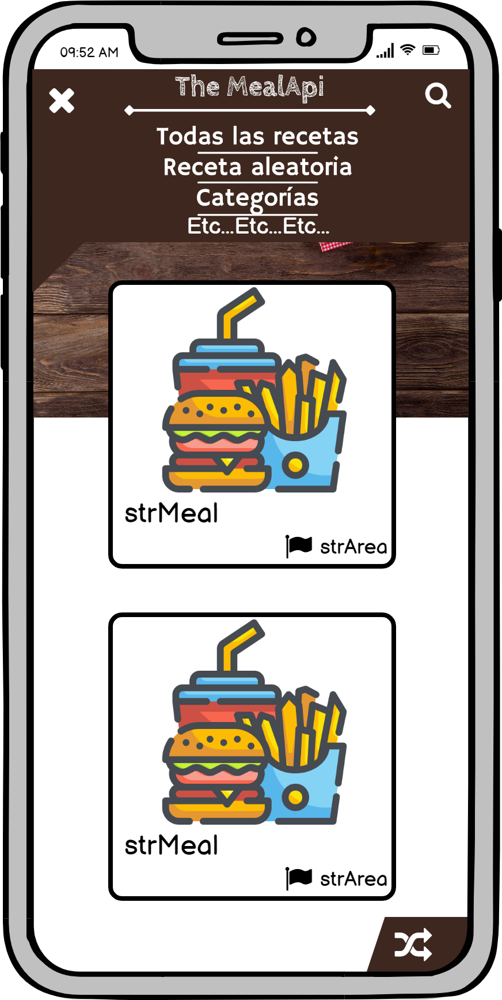
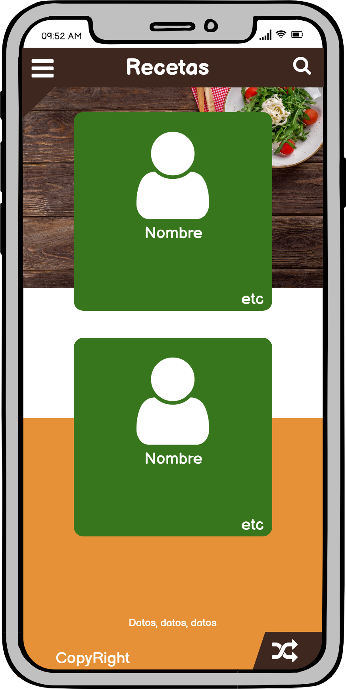
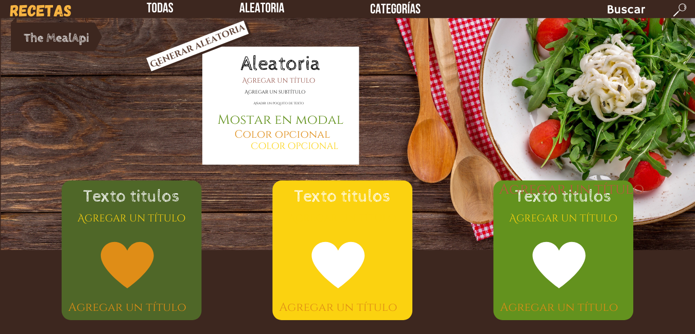
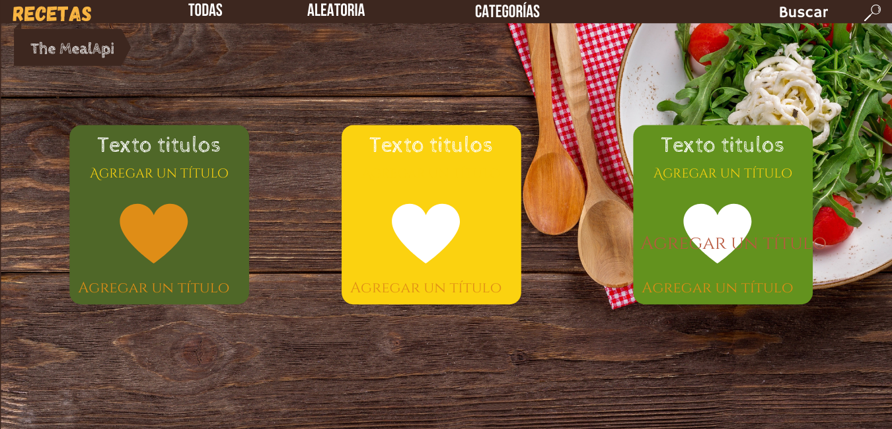
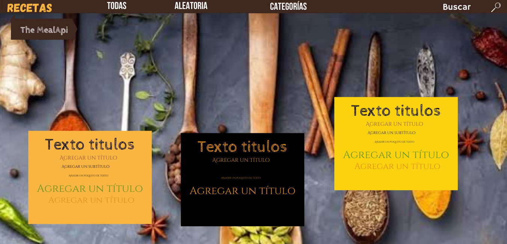
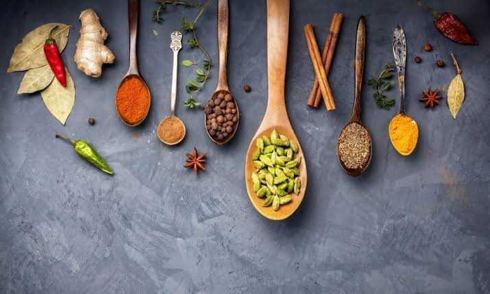

# Propuesta N° 1

## Paleta de colores
| Color | Descripción |
|-------|-------------|
| `#3D271F` | color café: para el fondo y navbar |
| `#4d3412` | color cafe: para contraste |
| `#F7CA15` | color amarillo: |
| `#FBD210` | color amarillo 2:  |
| `#4F6728` | color verde:  |
| `#B95A40` | color naranja:  |
| `#DF8D17` | color naranja 2:  |
| `#FFFFFF` | color blanco: para contraste |
| `#000000` | color negro: para contraste |
| `#63921e` | color verde 2: |
| `#f1e1bf` | color extra: |

## Fonts (@font-face)
* Título: `Cabin Sketch`
* Título: `Gagalin`
* Menú: `Bebas Neue`
* Texto: `Cinzel`
* Texto: `Cinzel Decorate`
* Texto: `Hasmmersith One`

---
## Mobile First
---
[Mockup movil  Ver a detalle](propuesta1/movil-mockup.pdf)

<!--  -->

  
&nbsp; &nbsp; &nbsp; &nbsp;
  
 &nbsp; &nbsp; &nbsp; &nbsp;
 

  
&nbsp; &nbsp; &nbsp; &nbsp;
  
 &nbsp; &nbsp; &nbsp; &nbsp;
 

 
 

---

* Al cargar muestra todas las recetas.
* Cuando se da click en buscar, con animación se recorre de derecha a izquierda la lupa y aparece un input, y al final el ícono x para borrar texto del input.
* Cuando se da click en el menú hamburguesa, despliega las opciones; la animación del menú cambia al ícono x.

## Web
### Inicio

Al cargar:
 - Genera una receta aleatoria.
 - Hay un botón en la tarjeta que genera una nueva receta aleatoria.
   - Cuando se haga scroll está el menú aleatorio que muestra una receta aleatoria en modal.

---

### Scrolls

En hover de una tarjeta:
 - Mostrar los datos.
 - Ocultar la imagen.

---

En focus buscar:
 - Ocultar aleatoria, todas y categorías, 
 - La lupa con animación se va a la izquierda y aparece el ícono cerrar(propuesta1/x)

---

### Footers

## assets

Nota: agregar los elementos que se necesiten
.
.
.
Aqui la tabla

# Ir a [Propuesta N° 2](https://github.com/14030598/santander-back-proyecto/tree/desarrollo/src/assets/mockups/propuesta2) 🚀
