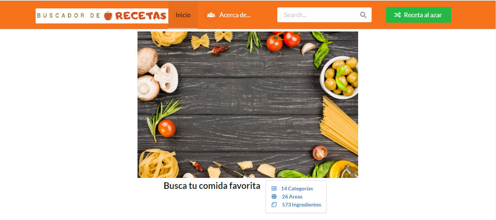
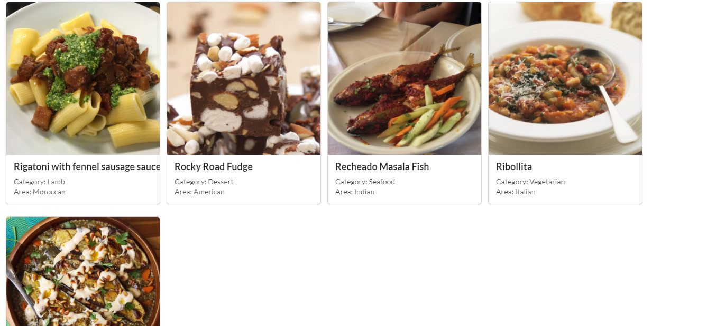
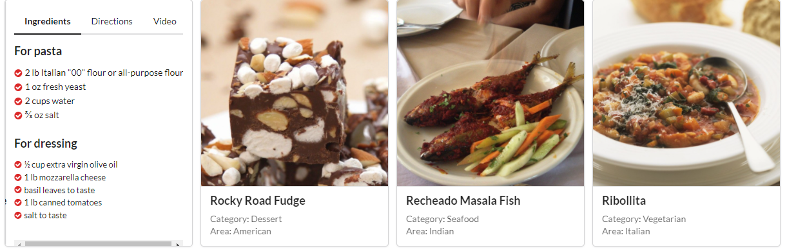
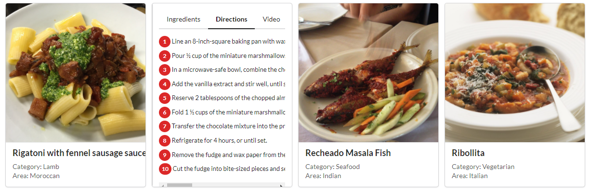
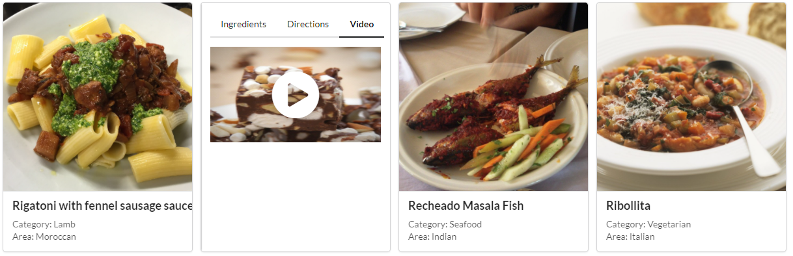
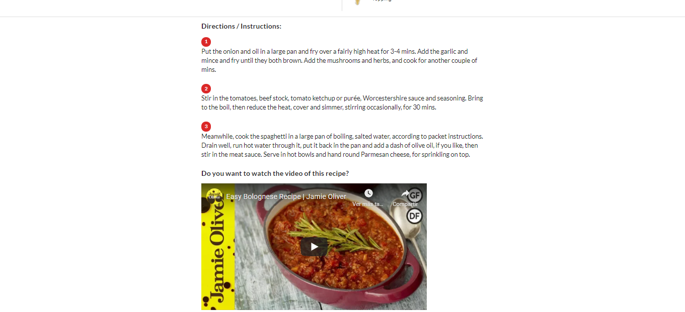

# Segunda Propuesta de Mockup
## Buscador de recetas
Sesión 8 - Postwork 2

_Configurar un ambiente de desarrollo para una aplicación nueva._


## Especificaciones 📋

*	Mostrar en la UI un input para ingresar texto y un botón para generar la búsqueda.
*	Utilizar la siguiente API para obtener los resultados: [TheMealDB](https://www.themealdb.com/)
*	Mostrar los resultados usando las imágenes de las recetas.
*	Al seleccionar una imagen se deben desplegar los detalles de la receta, es decir, los ingredientes y las instrucciones.
*	Mostrar en la UI un botón secundario para desplegar una receta aleatoria.

## Colores ❤️
```
@red            : #B03060;
@orange         : #FE9A76;
@yellow         : #FFD700;
@olive          : #32CD32;
@green          : #016936;
@teal           : #008080;
@blue           : #0E6EB8;
@violet         : #EE82EE;
@purple         : #B413EC;
@pink           : #FF1493;
@brown          : #A52A2A;
@grey           : #A0A0A0;
@black          : #000000;
@white          : #FFFFFF;
Custom1         : #f6731c;
Custom2         : #6311aa;
Custom3         : #f6731c
Custom4         : #00ba49
Custom5         : #4a008a
Custom6         : rga(238, 238, 238)

```

## Fonts ⌨️
```
Header: font-size: 4.5em;
Header Item: font-size: 1.2em;
Message: font-size: 1.3em;
Cards: font-size: 0.8em;
```

## Assets 📦
* [Logo](https://github.com/14030598/santander-back-proyecto/tree/desarrollo/src/assets/mockups/propuesta2/images/busc_receta_V2.png)

<p align="center">
  
&nbsp; &nbsp; &nbsp; &nbsp;
</p>

* [Menu](https://github.com/14030598/santander-back-proyecto/tree/desarrollo/src/assets/mockups/propuesta2/images/menu-buscador-de-recetas.png)
<p align="center">
  
&nbsp; &nbsp; &nbsp; &nbsp;
</p>

* [Imagen de inicio](https://github.com/14030598/santander-back-proyecto/tree/desarrollo/src/assets/mockups/propuesta2/images/ingredientes-comida-italiana.jpg)

<p align="center">
  
&nbsp; &nbsp; &nbsp; &nbsp;
</p>

* [Pie de página](https://github.com/14030598/santander-back-proyecto/tree/desarrollo/src/assets/mockups/propuesta2/images/footer.png)
<p align="center">
  
&nbsp; &nbsp; &nbsp; &nbsp;
</p>


## Estructura en Mobil ⚙️
```
1. Inicio
```
<p align="center">
  
</p>
<p align="center">
  
</p>
<p align="center">
  
</p>

```
2. Estadísticas de recetas
```
<p align="center">
  
&nbsp; &nbsp; &nbsp; &nbsp;
</p>


```
3. Mostrar recetas
```
<p align="center">
  
</p>
<p align="center">
  
</p>
<p align="center">
  
</p>
<p align="center">
  
</p>
<p align="center">
  
</p>

```
4. Mostrar detalle de receta
```
<p align="center">
  
<p align="center">
  
<p align="center">
  
<p align="center">
  
<p align="center">
  
<p align="center">
  

## Estructura en Navegador 🚀

```
1. Inicio
```
<p align="center">
  
</p>


```
2. Mostrar recetas
```
<p align="center">
  
</p>
<p align="center">
  
</p>
<p align="center">
  
</p>
<p align="center">
  
</p>

```
3. Mostrar detalle de receta
```

<p align="center">
  
</p>
<p align="center">
  
</p>

## Construido con 🛠️

* Paint
* [Paletas] https://www.colourlovers.com/
* [Fonts] https://semantic-ui.com/

## Resumen del API 📄
| # | Target| Link | Use |
| --- | --- | --- | --- |
| 1 | Search meal by name|www.themealdb.com/api/json/v1/1/search.php?s=Arrabiata | Search only meal name |
|2|Get the 25 first meals|www.themealdb.com/api/json/v1/1/search.php?s|Get first 25 recipes|
|3|List all meals by first letter|www.themealdb.com/api/json/v1/1/search.php?f=a|Get all the recipes whose food name begins with the search letter|
|4|Lookup full meal details by id|www.themealdb.com/api/json/v1/1/lookup.php?i=52772|Get recipe by id|
|5|Lookup a single random meal|www.themealdb.com/api/json/v1/1/random.php|Use general for get a single random meal|
|6|List all meal categories|www.themealdb.com/api/json/v1/1/categories.php|Use general for get categories with details|
|7|Latest Meals (only available to $2+ Patreon supporters)|www.themealdb.com/api/json/v1/1/latest.php|
|8|List all Categories|www.themealdb.com/api/json/v1/1/list.php?c=list|Get only name of category|
|9|List all Area|www.themealdb.com/api/json/v1/1/list.php?a=list|Use general for get areas|
|10|List all Ingredients|www.themealdb.com/api/json/v1/1/list.php?i=list|Use for get about 573 ingredients|
|11|Filter by main ingredient|www.themealdb.com/api/json/v1/1/filter.php?i=chicken_breast|Use for get recipes by only one ingredient|
|12|Filter by Category|www.themealdb.com/api/json/v1/1/filter.php?c=Seafood|Use for get recipes by Category|
|13|Filter by Area|www.themealdb.com/api/json/v1/1/filter.php?a=Canadian|Use for get recipes by Area
|14|Meal Thumbnail Images|/images/media/meals/llcbn01574260722.jpg/preview|Add "/preview" to the end of the meal image URL (strMealThumb node).|
|15|Ingredient Thumbnail Images	|"www.themealdb.com/images/ingredients/Lime.png
www.themealdb.com/images/ingredients/Lime-Small.png"|Mode of obtaining the images of the ingredients|

<br><br>
| Comando | Descripción |
| --- | --- |
| git status | Enumera todos los archivos nuevos o modificados |
| git diff | Muestra las diferencias de archivo que no han sido preparadas |

## Control de Versiones 📌

Usamos git para el versionado. Para todas las versiones disponibles, revisar [este repositorio](https://github.com/14030598/santander-back-proyecto/).

## Autores ✒️

Team 4:
- Vicente Barbosa León
- Alicia Flores Flores
- Fabiola Rasgado Celaya
- Luis Manuel Tapia Bautista
- Carlos Ivan Vargas Jiménez

