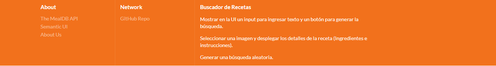
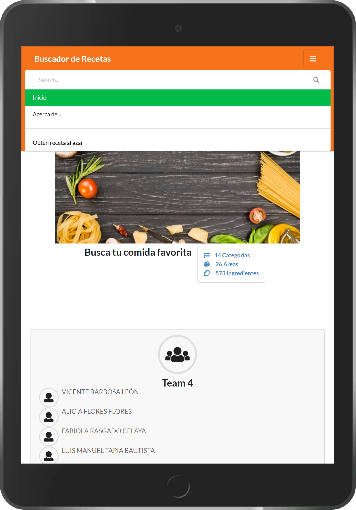
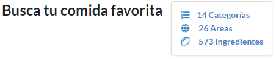
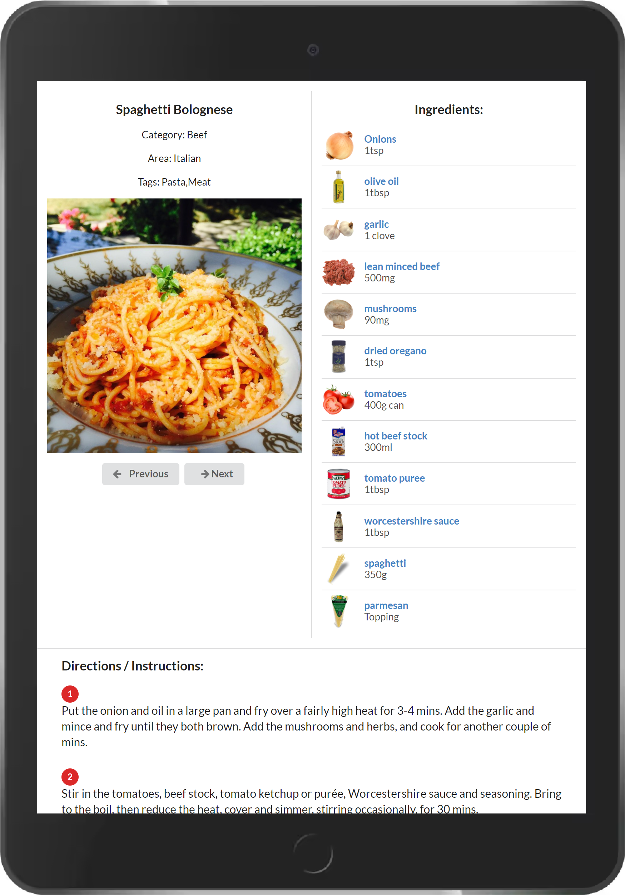

# Propuesta de Mockups
## Buscador de recetas
Sesión 8 - Postwork 2

_Configurar un ambiente de desarrollo para una aplicación nueva._


### Especificaciones 📋

*	Mostrar en la UI un input para ingresar texto y un botón para generar la búsqueda.
*	Utilizar la siguiente API para obtener los resultados: [TheMealDB](https://www.themealdb.com/)
*	Mostrar los resultados usando las imágenes de las recetas.
*	Al seleccionar una imagen se deben desplegar los detalles de la receta, es decir, los ingredientes y las instrucciones.
*	Mostrar en la UI un botón secundario para desplegar una receta aleatoria.

## Colores
```
@red            : #B03060;
@orange         : #FE9A76;
@yellow         : #FFD700;
@olive          : #32CD32;
@green          : #016936;
@teal           : #008080;
@blue           : #0E6EB8;
@violet         : #EE82EE;
@purple         : #B413EC;
@pink           : #FF1493;
@brown          : #A52A2A;
@grey           : #A0A0A0;
@black          : #000000;
@white          : #FFFFFF;
Custom1         : #f6731c;
Custom2         : #6311aa;
Custom3         : #f6731c
Custom4         : #00ba49
Custom5         : #4a008a
Custom6         : rga(238, 238, 238)

```

## Fonts
```
Header: font-size: 4.5em;
Header Item: font-size: 1.2em;
Message: font-size: 1.3em;
Cards: font-size: 0.8em;
```

## Assets
* [Logo](https://github.com/14030598/santander-back-proyecto/tree/desarrollo/src/assets/mockups/propuesta2/images/busc_receta_V2.png)

<p align="center">
  
&nbsp; &nbsp; &nbsp; &nbsp;
</p>

* [Menu](https://github.com/14030598/santander-back-proyecto/tree/desarrollo/src/assets/mockups/propuesta2/images/menu-buscador-de-recetas.png)
<p align="center">
  
&nbsp; &nbsp; &nbsp; &nbsp;
</p>

* [Imagen de inicio](https://github.com/14030598/santander-back-proyecto/tree/desarrollo/src/assets/mockups/propuesta2/images/ingredientes-comida-italiana.jpg)

<p align="center">
  
&nbsp; &nbsp; &nbsp; &nbsp;
</p>

* [Pie de página](https://github.com/14030598/santander-back-proyecto/tree/desarrollo/src/assets/mockups/propuesta2/images/footer.png)
<p align="center">
  
&nbsp; &nbsp; &nbsp; &nbsp;
</p>


```
```


## Estructura en Mobil ⚙️
```
1. Inicio
```
<p align="center">
  
<p align="center">
  
<p align="center">
  

  
&nbsp; &nbsp; &nbsp; &nbsp;
</p>

```
2. Estadísticas de recetas
```
<p align="center">
  
&nbsp; &nbsp; &nbsp; &nbsp;
</p>


```
2. Mostrar recetas
```
<p align="center">
  
<p align="center">
  
<p align="center">
  
<p align="center">
  
<p align="center">
  

```
3. Mostrar detalle de receta
```
<p align="center">
  
<p align="center">
  
<p align="center">
  
<p align="center">
  
<p align="center">
  
<p align="center">
  

## Estructura en Navegador ⚙️
```
```

## Especificaciones 🚀

* []()

```
```


* [Ejercicio 2](https://github.com/14030598/santander-back-proyecto/blob/master/ejemplos-sesion04-postwork2.js)
```
- Escribir una función chunk que recibe un arreglo y un número entero size. 
- La función debe dividir el arreglo en múltiples arreglos del tamaño determinado por size.
```


## Construido con 🛠️

* Paint
* [Paletas] https://www.colourlovers.com/
* [Fonts] https://semantic-ui.com/


## Control de Versiones 📌

Usamos git para el versionado. Para todas las versiones disponibles, revisar [este repositorio](https://github.com/14030598/santander-back-proyecto/).

## Autores ✒️

Team 4:
- Vicente Barbosa León
- Alicia Flores Flores
- Fabiola Rasgado Celaya
- Luis Manuel Tapia Bautista
- Carlos Ivan Vargas Jiménez

